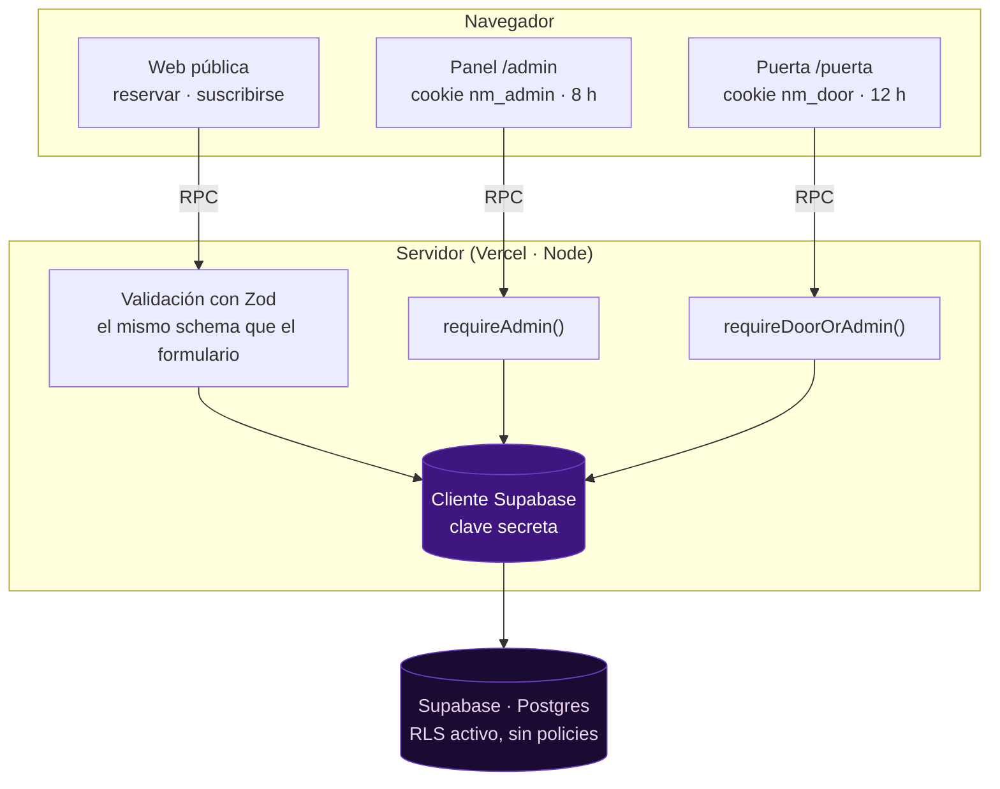

<div align="center">


# Nemorphic

**Más que groove, cultura.**

Sitio web del sello techno Nemorphic: presenta a los artistas y los lanzamientos,
recibe reservas de cupo para los eventos y trae consigo dos herramientas internas —
un panel de gestión y un control de entrada para la puerta.

[](https://nemorphic.vercel.app)
[](https://tanstack.com/start)
[](https://react.dev)
[](https://www.typescriptlang.org)
[](https://supabase.com)

</div>

---

## Qué hace

El proyecto son tres superficies con permisos distintos sobre los mismos datos.

| Superficie             | Ruta      | Quién entra                                                          | Qué puede hacer                                                                               |
| ---------------------- | --------- | -------------------------------------------------------------------- | --------------------------------------------------------------------------------------------- |
| **Web pública**        | `/`       | Cualquiera                                                           | Ver artistas y lanzamientos, reservar cupo para un evento, suscribirse al boletín             |
| **Panel**              | `/admin`  | El equipo del sello, con clave compartida                            | Todo: ver y editar reservas y suscriptores, cobrar, fijar precios y abrir el acceso de puerta |
| **Control de entrada** | `/puerta` | Quien atiende la entrada, con clave propia que cambia en cada evento | Buscar reservas y marcar quién entró y quién pagó. **No puede editar nada más**               |

Que la puerta no pueda editar es deliberado: si pudiera cambiar un nombre, bastaría
con eso para colar a otra persona con una reserva ajena.

### Reservar un cupo

Quien reserva elige evento, deja nombre, correo, teléfono y cuántas entradas quiere.
Al pedir más de una, se abren solos los campos para el nombre de cada acompañante.
Al terminar recibe un **código de 4 caracteres** (`Q7F3`) que presenta en la puerta —
sin vocales ni caracteres que se confundan al dictarlos por teléfono.

Ese código sustituye a pedir la cédula: identifica la reserva sin guardar un dato
personal sensible.

---

## Puesta en marcha

**Requisitos:** Node.js 24+ y npm. Acceso al proyecto de Supabase.

```sh
git clone https://github.com/JLowZz2806/Nemorphic.git
cd Nemorphic
npm install

cp .env.example .env      # y rellenar los valores (ver abajo)
npm run dev               # http://localhost:8080
```

### Variables de entorno

Todas son **solo de servidor**: ninguna lleva prefijo `VITE_`, porque eso las
publicaría dentro del JavaScript que descarga cualquier visitante.

| Variable              | Para qué                                                                   |
| --------------------- | -------------------------------------------------------------------------- |
| `SESSION_SECRET`      | Cifra y firma las cookies de sesión. Aleatoria, 32+ caracteres             |
| `ADMIN_PASSWORD_HASH` | Hash de la clave del panel. Se genera con `node scripts/hash-password.mjs` |
| `SUPABASE_URL`        | Base del proyecto, **sin** `/rest/v1/`                                     |
| `SUPABASE_SECRET_KEY` | Clave secreta de Supabase (`sb_secret_…`). Salta RLS: nunca al cliente     |

`.env` está en `.gitignore`. Las mismas variables van en Vercel
(Settings → Environment Variables, los tres entornos) y **hay que redesplegar** para
que surtan efecto.

La clave de la puerta no es una variable: se guarda cifrada en la base y se cambia
desde `/admin`, porque cambia en cada evento.

---

## Comandos

| Comando                            | Qué hace                                                                      |
| ---------------------------------- | ----------------------------------------------------------------------------- |
| `npm run dev`                      | Servidor de desarrollo en el puerto 8080                                      |
| `npm run check`                    | **typecheck + lint + smoke.** Ejecutar antes de dar por terminado un cambio   |
| `npm run typecheck`                | `tsc --noEmit`                                                                |
| `npm run lint`                     | ESLint + Prettier                                                             |
| `npm run format`                   | Reescribe con Prettier                                                        |
| `npm run smoke`                    | Levanta el sitio y verifica el HTML renderizado y que el panel esté protegido |
| `npm run test:panel`               | Pruebas de funcionalidad y seguridad contra la base real                      |
| `npm run db:status`                | Qué migraciones de `supabase/migrations/` están aplicadas                     |
| `npm run build`                    | Build de producción                                                           |
| `node scripts/hash-password.mjs`   | Genera `ADMIN_PASSWORD_HASH` y `SESSION_SECRET`                               |
| `node scripts/optimize-images.mjs` | Informe de peso de `public/Assets` (`--apply` para reprocesar)                |

`db:status` y `test:panel` leen `.env`, así que necesitan las variables de Supabase.
`test:panel` crea filas con correos `@ejemplo.test` y **las borra al terminar**; no
toca los datos reales.

---

## Arquitectura

El navegador nunca habla con Supabase. Toda lectura y escritura pasa por una
_server function_ que valida sesión y entrada antes de tocar la base.



Tres decisiones sostienen la seguridad:

1. **RLS activo y sin ninguna policy** en todas las tablas. Una tabla así deniega
   todo a los roles públicos de Supabase; solo entra la clave secreta, que vive en
   el servidor. Si la clave pública se filtrara, no daría acceso a nada.
2. **Cada server function valida la sesión por su cuenta.** `beforeLoad` protege la
   navegación, no la API: cualquiera puede llamar a una server function con `fetch`
   sin pasar por la página.
3. **Cookies separadas por rol.** `requireAdmin()` mira `nm_admin` y rechaza una
   sesión de puerta aunque sea válida, así que el rol de puerta no puede escalar.

Detalle completo en [`docs/arquitectura.md`](docs/arquitectura.md).

---

## Estructura

```
src/
├─ routes/                   Rutas (file-based routing de TanStack Router)
│  ├─ index.tsx              Landing completa: hero, artistas, lanzamientos, eventos, modales
│  ├─ admin/                 Panel privado: login + layout protegido `_panel` + secciones
│  └─ puerta/                Control de entrada: login + layout protegido `_lista`
├─ actions/                  Server functions. El cliente las llama por RPC
├─ schemas/                  Schemas Zod compartidos entre cliente y servidor
├─ components/nemorphic/     Modal, formularios e iconos propios del sitio
├─ components/ui/            shadcn/ui (46 componentes)
├─ lib/                      auth, cliente de Supabase, guardas de sesión, utilidades
├─ data/nemorphic.ts         Artistas y lanzamientos (contenido en el repo)
└─ styles.css                Sistema visual `nm-*` + tokens

supabase/migrations/         SQL versionado, se aplica a mano en el SQL Editor
scripts/                     Verificación, pruebas y utilidades
tests/                       Arnés de pruebas del panel (no se despliega)
public/Assets/               Imágenes reales del sitio
```

---

## Base de datos

Cinco tablas en Supabase. El esquema completo, con cada columna y por qué existe,
está en [`docs/base-de-datos.md`](docs/base-de-datos.md).

| Tabla                | Guarda                                                           |
| -------------------- | ---------------------------------------------------------------- |
| `events`             | Eventos, con precio reservando y precio en puerta                |
| `reservations`       | Reservas: titular, entradas, código, estado de ingreso y de pago |
| `reservation_guests` | Acompañantes, una fila por persona adicional                     |
| `subscribers`        | Personas suscritas al boletín, con su nombre                     |
| `app_settings`       | Ajustes editables desde el panel (hoy: la clave de puerta)       |

Las migraciones **se aplican a mano** desde el SQL Editor de Supabase: la clave
secreta habla por PostgREST, que no permite crear ni alterar tablas. Comprueba el
estado con `npm run db:status`.

---

## Documentación

| Documento                                        | Para quién                                                           |
| ------------------------------------------------ | -------------------------------------------------------------------- |
| [`docs/arquitectura.md`](docs/arquitectura.md)   | Quien vaya a tocar el código                                         |
| [`docs/base-de-datos.md`](docs/base-de-datos.md) | Esquema, migraciones y consultas                                     |
| [`docs/operacion.md`](docs/operacion.md)         | **El equipo del sello**: cómo usar el panel y la puerta en un evento |
| [`CLAUDE.md`](CLAUDE.md)                         | Convenciones del proyecto y contexto para Claude Code                |
| [`roadmap.md`](roadmap.md)                       | Qué falta y en qué orden                                             |
| [`.claude/skills/`](.claude/skills/)             | Guías por tarea (base de datos, correo, seguridad, UI…)              |

---

## Despliegue

Cada `push` a `main` despliega automáticamente en
[Vercel](https://nemorphic.vercel.app). El repositorio también está conectado a
Lovable, así que **no se debe reescribir la historia publicada** (nada de
`rebase`, `amend`, `squash` ni `force-push`): rompería la sincronía.

Un detalle que confunde: `npm run build` **en local** genera un bundle de Cloudflare,
porque esa es la configuración por defecto que hereda el proyecto. En Vercel, Nitro
detecta el proveedor y construye para Vercel. Es normal y no hay que "arreglarlo".

---

<div align="center">
<sub><strong>Nemorphic</strong> · Más que groove, cultura.</sub>
</div>
