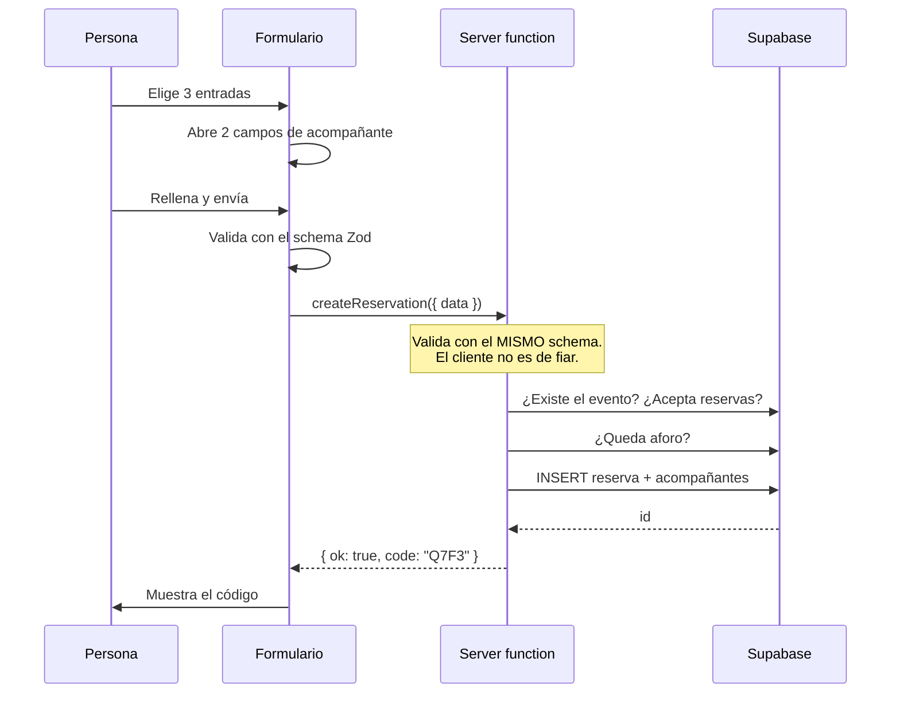

# Arquitectura

Cómo encaja el proyecto y por qué está hecho así. Para quien vaya a tocar el código.

Si lo que buscas es usar el panel en un evento, ve a [`operacion.md`](operacion.md).

---

## La idea en una frase

El navegador **nunca** habla con la base de datos. Todo pasa por el servidor, que
valida quién eres y qué mandas antes de tocar nada.

Eso no es una preferencia estilística: es lo que permite que la base de datos esté
completamente cerrada al mundo y que un formulario público no pueda hacer más de lo
que su formulario permite.

---

## El recorrido de una reserva

El punto que importa: **el mismo schema Zod valida dos veces**. En el cliente para
dar feedback inmediato, y en el servidor porque cualquiera puede saltarse el
formulario y llamar a la server function directamente con `fetch`.

Está probado: `npm run test:panel` llama a `createReservation` con 3 entradas y 0
acompañantes, y el servidor la rechaza.

---

## Las tres capas de una escritura

Toda escritura del sitio sigue la misma estructura de tres archivos:

| Capa           | Dónde                       | Responsabilidad                                                       |
| -------------- | --------------------------- | --------------------------------------------------------------------- |
| **Schema**     | `src/schemas/<dominio>.ts`  | La verdad sobre qué es un dato válido. Se importa desde los dos lados |
| **Acción**     | `src/actions/<dominio>.ts`  | Server function: valida sesión, aplica reglas de negocio, escribe     |
| **Formulario** | `src/components/nemorphic/` | react-hook-form + TanStack Query + `sonner` para el aviso             |

> **Nunca uses `src/server/`.** La configuración de Lovable prohíbe que el cliente
> importe de `**/server/**` con `behavior: "error"`. El servidor de desarrollo lo
> tolera, pero `npm run build` falla y el despliegue se cae. Por eso las server
> functions viven en `src/actions/`.

---

## Sesiones y roles

Hay dos accesos privados, con **cookies distintas a propósito**.

|                       | Panel                                      | Puerta                                                   |
| --------------------- | ------------------------------------------ | -------------------------------------------------------- |
| Ruta                  | `/admin`                                   | `/puerta`                                                |
| Cookie                | `nm_admin`                                 | `nm_door`                                                |
| Duración              | 8 h (una jornada)                          | 12 h (una noche de evento)                               |
| Dónde vive la clave   | `ADMIN_PASSWORD_HASH`, variable de entorno | Hash en la tabla `app_settings`, editable desde el panel |
| Guarda en el servidor | `requireAdmin()`                           | `requireDoorOrAdmin()`                                   |

Las cookies van cifradas y firmadas (`useSession` de TanStack Start), con
`HttpOnly`, `Secure` y `SameSite=Lax`. El cliente no puede leerlas ni falsificarlas:
está comprobado que una cookie inventada y una manipulada se rechazan.

### Por qué cookies separadas

Con una sola cookie y un campo `rol` dentro, un error al leer ese campo convertiría
una sesión de puerta en una de admin. Con cookies separadas, `isAdmin()` mira otra
cookie: el rol de puerta **no puede escalar** aunque el código tenga un bug de
lógica.

### Por qué la clave de puerta vive en la base

Cambia en cada evento. Si fuera una variable de entorno, cambiarla obligaría a
entrar a Vercel, editarla y redesplegar cada vez. En la base, se cambia desde el
panel y surte efecto al instante.

Se guarda el **hash** con scrypt y sal aleatoria, nunca la clave. Comparar con
`timingSafeEqual` evita que el tiempo de respuesta revele cuántos caracteres del
principio son correctos.

---

## Lo que se guarda de cada acción

`reservations` no solo guarda el estado, sino **desde dónde** se cambió:

- `checked_in_at` / `checked_in_by` — cuándo entró y si lo marcó el panel o la puerta.
- `paid_at` / `paid_by` — lo mismo para el cobro.

Sirve para cuadrar caja después del evento y para notar si algo se marcó donde no
debía. La base rechaza cualquier valor que no sea `'admin'` o `'door'`.

---

## Defensas de los formularios públicos

Los formularios de reserva y boletín escriben en la base sin autenticación. Lo que
los protege:

- **Validación en el servidor** con límites explícitos: entradas entre 1 y 10,
  longitudes máximas en nombre, correo y teléfono.
- **Campo trampa** en el boletín: un campo oculto por CSS que una persona nunca
  rellena. Si llega con contenido, el servidor responde `ok` **sin guardar nada** —
  el bot debe creer que funcionó, porque un error le confirmaría que fue detectado.
- **Sin enumeración**: suscribirse responde igual exista o no el correo, así que el
  formulario no sirve para averiguar quién está en la lista.
- **Límite de intentos** por IP en los dos logins, con espera creciente y respuesta
  uniforme ante el fallo.

---

## Renderizado y despliegue

TanStack Start renderiza en el servidor (SSR) y luego hidrata. Las consecuencias
prácticas:

- `beforeLoad` corre en el servidor durante el SSR y en el cliente al navegar. Por
  eso consulta la sesión con una server function, no leyendo la cookie a mano.
- El componente de un modal cerrado **no se renderiza**, así que su contenido no
  aparece en el HTML inicial. Tenlo en cuenta al escribir comprobaciones del smoke
  test.
- En producción el runtime es **Node** (preset de Vercel), así que `process.env` y
  `node:crypto` funcionan. En local, `npm run build` genera un bundle de Cloudflare
  por la configuración heredada; es normal.

---

## Cómo se verifica

| Comando              | Qué cubre                                                                     |
| -------------------- | ----------------------------------------------------------------------------- |
| `npm run check`      | Tipos, lint y que la home y las rutas privadas responden bien                 |
| `npm run test:panel` | 47 comprobaciones contra la base real: permisos, validación, datos y limpieza |

`test:panel` funciona copiando `tests/panel-checks.route.tsx` a `src/routes/`
mientras dura la prueba, y borrándolo siempre al terminar. Vive fuera de
`src/routes/` a propósito: **contiene borrados y no debe desplegarse nunca**.

Las filas que crea usan correos `@ejemplo.test` y se borran al final. La última
comprobación verifica justo eso, y además informa de cuántos datos reales quedan,
para notar de un vistazo si una prueba se llevó por delante algo que no era suyo.
