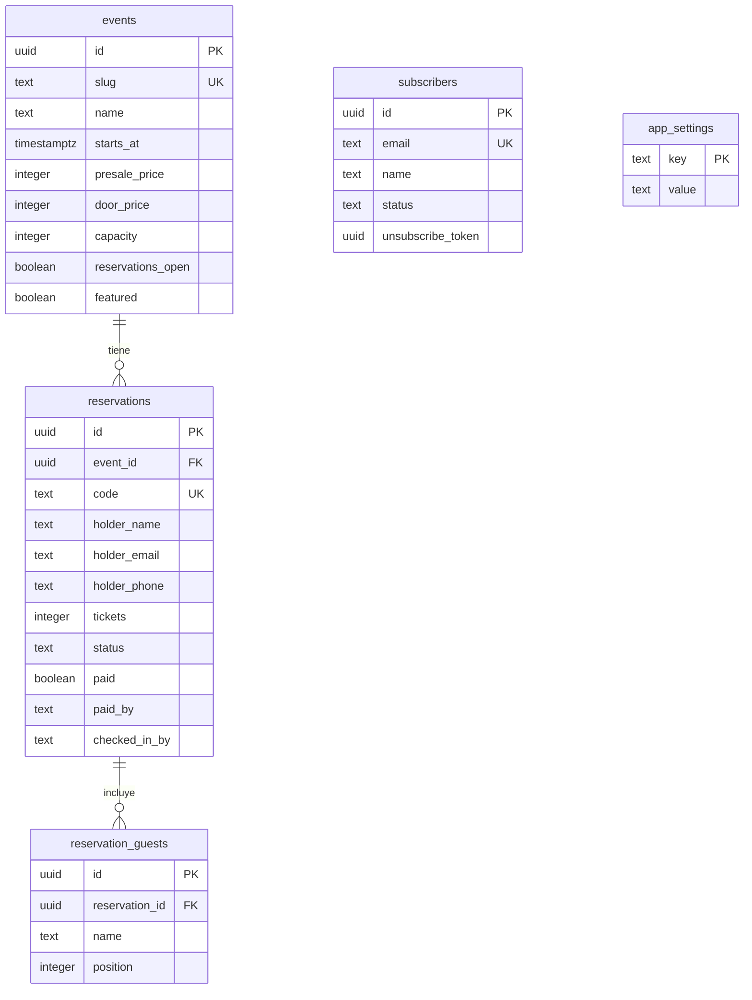

# Base de datos

Supabase (Postgres gestionado). Cinco tablas, todas cerradas al mundo.

---

## Modelo de acceso

**RLS activado y sin ninguna policy** en todas las tablas.

En Postgres, una tabla con RLS activo y sin policies **deniega todo** a los roles
`anon` y `authenticated` — los que usa la clave pública de Supabase. La clave
secreta que usa el servidor salta RLS por diseño.

El resultado: aunque alguien copiara la clave pública del panel de Supabase, no
podría leer ni una fila. Está comprobado en `npm run test:panel`.



---

## Tablas

### `events`

| Columna                | Tipo          | Notas                                                    |
| ---------------------- | ------------- | -------------------------------------------------------- |
| `slug`                 | `text` único  | Identificador legible: `umbra`                           |
| `name`, `tagline`      | `text`        | Nombre y frase del evento                                |
| `starts_at`, `ends_at` | `timestamptz` | Se guardan con desfase de Colombia (`-05`)               |
| `venue`, `address`     | `text`        | Lugar y dirección                                        |
| `poster_url`           | `text`        | Ruta del flyer bajo `/Assets/`                           |
| `capacity`             | `integer`     | `null` = sin límite de aforo                             |
| `presale_price`        | `integer`     | **Lo que paga quien reservó**, aunque pague en la puerta |
| `door_price`           | `integer`     | Lo que paga quien llega sin reserva. Solo informativo    |
| `reservations_open`    | `boolean`     | Si el formulario público acepta reservas                 |
| `featured`             | `boolean`     | El que la landing muestra en `#eventos`. **Solo uno**    |

Los precios van en pesos, sin decimales. `presale_price` es el incentivo de
reservar: se respeta aunque la persona pague en la entrada.

`featured` marca el evento que sale en la portada. Que solo pueda haber uno lo
garantiza la base con un índice parcial (`events_un_solo_destacado`), no el panel:
con dos marcados, la landing elegiría uno distinto según el orden en que Postgres
devolviera las filas. La consulta pública filtra además por `reservations_open` y por
fecha futura, así que un evento pasado desaparece de la web sin tocar nada.

### `reservations`

| Columna                          | Tipo              | Notas                                                           |
| -------------------------------- | ----------------- | --------------------------------------------------------------- |
| `event_id`                       | `uuid` → `events` | `on delete restrict`: no se puede borrar un evento con reservas |
| `holder_name/email/phone`        | `text`            | Datos del titular                                               |
| `tickets`                        | `integer`         | Entre 1 y 10                                                    |
| `code`                           | `text` único      | 4 caracteres. Lo que se presenta en la puerta                   |
| `status`                         | `text`            | `confirmed` · `cancelled` · `checked_in`                        |
| `paid`, `paid_at`, `paid_by`     |                   | `paid_by` solo admite `'admin'` o `'door'`                      |
| `checked_in_at`, `checked_in_by` |                   | Igual, para el ingreso                                          |

**No hay columna de cédula, y es deliberado.** Es un dato personal sensible y el
código de 4 caracteres cumple la misma función de identificar la reserva. Si algún
día hiciera falta, va en una migración aparte y con las cautelas de la skill
`security`.

### `reservation_guests`

Una fila por cada acompañante. El titular **no** va aquí: si una reserva es de 3
entradas, hay 2 acompañantes.

`position` es único por reserva, y el borrado va **en cascada**: al borrar una
reserva desaparecen sus acompañantes.

### `subscribers`

| Columna             | Notas                                                             |
| ------------------- | ----------------------------------------------------------------- |
| `email` único       | Permite `upsert`: suscribirse dos veces no duplica ni falla       |
| `name`              | Nullable. Para encabezar el boletín con el nombre de cada persona |
| `status`            | `active` · `unsubscribed`                                         |
| `unsubscribe_token` | uuid, para darse de baja con un clic y sin login                  |

### `app_settings`

Clave-valor para ajustes editables desde el panel. Hoy guarda una sola cosa:
`door_password_hash`, el hash de la clave de la puerta.

Si la fila no existe, el acceso de puerta está **cerrado**.

---

## Migraciones

Se aplican **a mano** desde el SQL Editor de Supabase. No es pereza: la clave
secreta habla por PostgREST, que permite leer y escribir filas pero **no crear ni
alterar tablas**. Crear una columna requiere el SQL Editor; crear una fila no.

```sh
npm run db:status   # dice qué falta por aplicar
```

Si aparece algo como PENDIENTE:

1. supabase.com → tu proyecto → **SQL Editor** → **New query**
2. Pega el contenido del archivo que aparece en `supabase/migrations/`
3. **Run**
4. `npm run db:status` otra vez para confirmar

| Archivo                        | Qué añade                                              |
| ------------------------------ | ------------------------------------------------------ |
| `0001_reservas.sql`            | Las cuatro tablas base, índices, RLS y el evento UMBRA |
| `0002_suscriptores_nombre.sql` | `subscribers.name`, para personalizar el boletín       |
| `0003_pagos_y_puerta.sql`      | Precios por evento, estado de pago y `app_settings`    |

### Reglas al escribir una migración

- **Una por cambio**, numerada y con nombre descriptivo.
- **Nunca edites una ya aplicada.** Crea la siguiente.
- Usa `if not exists` / `on conflict do nothing` para que volver a ejecutarla no
  rompa nada.
- Toda tabla nueva necesita `enable row level security` y **ninguna policy**.
- Después, añade su comprobación a `scripts/db-status.mjs`.

---

## Reglas al consultar

- **`select` explícito**: `.select("id, name, starts_at")`, nunca `select("*")` en
  código que devuelve datos al cliente. Evita filtrar columnas nuevas sin querer.
- **La cadena del `select` debe ser un literal de una pieza.** Supabase infiere los
  tipos analizando ese texto; una concatenación en tiempo de ejecución hace que
  TypeScript pierda el tipo y falle el `typecheck`.
- **Comprueba siempre `error` antes de usar `data`.** `data` puede ser `null`.
- **Nunca devuelvas el error crudo de Postgres al cliente**: filtra nombres de
  tablas y columnas. Registra el detalle con `console.error` y responde un mensaje
  genérico en español.

---

## Aforo: la limitación conocida

El control de aforo cuenta las reservas y luego inserta, en dos consultas separadas.
Si dos personas reservan a la vez las últimas entradas, ambas pueden pasar.

Con los aforos actuales (`capacity` sin definir) no aplica. Cuando haya un aforo
ajustado, hay que moverlo a una función de Postgres que bloquee la fila del evento
con `select ... for update` antes de validar e insertar, y llamarla con
`supabase.rpc()`.

---

## Consultar los datos a mano

Desde el proyecto, con las variables cargadas:

```sh
node --env-file=.env -e "
const {createClient}=require('@supabase/supabase-js');
const s=createClient(process.env.SUPABASE_URL,process.env.SUPABASE_SECRET_KEY,{auth:{persistSession:false}});
s.from('reservations').select('code, holder_name, tickets, paid').then(r=>console.table(r.data));
"
```

Crear o editar **filas** se puede desde aquí. Crear o alterar **tablas**, no.
